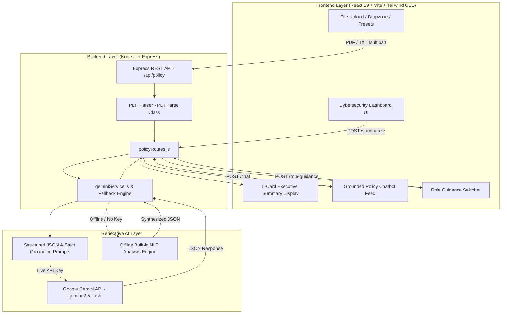

# 🛡️ Generative AI-Powered Cybersecurity Policy Summarizer & Grounded Q&A Assistant

> **College AI Project (LO 6.1 & LO 6.2 Implementation)**  
> An enterprise-grade, full-stack application that translates complex, jargon-heavy cybersecurity policies into structured executive summaries, strictly grounded Q&A responses, and persona-specific compliance checklists using **Google Gemini Generative AI**.

---

## 👨‍🎓 Student & Academic Details

| Field | Details |
| :--- | :--- |
| **Student Name** | **Roshwyn Fernandes** |
| **Roll Number** | **5024120** |
| **Class & Semester** | **TY IT - Semester V** |
| **Domain** | **Artificial Intelligence / Cybersecurity Process Reengineering** |
| **Implementation Scope** | **LO 6.1 (Generative AI Integration) & LO 6.2 (Prompt Engineering & Grounding)** |

---

## 📚 Academic Research Paper Reference

This project is directly inspired and architecturally grounded in the following IEEE research publication:

* **Paper Title**: *Reengineering Cybersecurity Processes with Generative AI: From Automation to Strategic Alignment*
* **Author**: Mehrdad S. Sharbaf (*Senior IEEE Life Member, Sharbaf and Associates LLC*)
* **Conference**: 5th IEEE International Conference on AI in Cybersecurity (ICAIC)
* **Venue & Date**: University of Houston, Houston, United States | 18–20 February 2026
* **IEEE Publication Details**: `978-1-6654-7761-1/26/$31.00 ©2026 IEEE`
* **DOI**: [`10.1109/ICAIC67076.2026.11395839`](https://doi.org/10.1109/ICAIC67076.2026.11395839)

### 🔗 Mapping the Project to the IEEE 5-Phase Reengineering Model:
According to **Table I** of the IEEE paper (*"A five-phase model for GenAI-enabled cybersecurity process reengineering"*):

```
+----------------------------------------------------------------------------------------------------+
|                                    IEEE 5-PHASE REENGINEERING MODEL                                |
+-------------------------+------------------------------------+-------------------------------------+
| Phase                   | IEEE Paper Framework               | Project Implementation              |
+-------------------------+------------------------------------+-------------------------------------+
| 1. Discovery            | NLP analysis of documentation/logs | In-memory PDF & TXT parser engine   |
| 2. Translation          | Frameworks (NIST/ISO) into visuals | 5 Structured Executive Cards        |
| 3. Role Alignment       | Clarify stakeholder roles/playbook | Persona Guidance (Employee/Admin/SOC)|
| 4. Risk Mitigation      | Mitigating hallucination & bias    | Strict Prompt Grounding & Fallback  |
| 5. Continuous Workflow  | Fast interactive feedback loops    | Real-time Grounded Chatbot Feed     |
+-------------------------+------------------------------------+-------------------------------------+
```

---

## 📋 Problem Statement & Overview

### The Challenge
Organizational cybersecurity policies (such as *Remote Access Guidelines*, *MFA Protocols*, *Password Security*, and *Incident Response Plans*) are traditionally written in **dense, 50+ page legalistic formats**. As a result:
* **Over 80% of employees** do not read or fully comprehend security mandates.
* Non-technical staff miss critical operational requirements (e.g., prohibition of SMS-based OTP or lost device reporting SLA).
* Traditional AI chatbots often suffer from **hallucinations**, inventing security advice that is not authorized by the organization.

### The Solution
This application leverages Google Gemini (`gemini-2.5-flash`) combined with **Strict Context Grounding** and **Structured Output Prompts**:
1. **Document Ingestion**: Uploads official PDF/TXT security policies or pastes raw policy text.
2. **Automated Structured Summarization**: Generates 5 executive categories (Overview, Key Requirements, Prohibited Rules, Employee Actions, Consequences & Threat Vectors).
3. **Persona-Tailored Checklists**: Dynamic action matrices for **Employees**, **Department Managers**, **IT Administrators**, and **Security Officers (SOC)**.
4. **Zero-Hallucination Q&A Chatbot**: Answers queries *strictly* from the text. If an answer does not exist in the policy, it explicitly responds:  
   > *"This information is not available in the provided policy."*

---

## 🏛️ System Architecture



---

## 🛠️ Technology Stack

| Layer | Component | Description |
| :--- | :--- | :--- |
| **Frontend UI** | React 19, Vite 8, Tailwind CSS v4 | Dark cybersecurity dashboard, responsive glassmorphic cards, metrics counter |
| **Icons & Visuals** | Lucide React Icons | Shield, Terminal, Bot, UserCheck, Key badges |
| **API Client** | Axios | Configured client with timeouts and unified error normalization |
| **Backend Runtime** | Node.js (v20+ / v25+), Express 5 | RESTful backend, CORS enabled, unified error handling |
| **File Processing** | Multer + `pdf-parse` v2.4.5 | In-memory binary buffer streaming and page-level text extraction |
| **Generative AI** | `@google/genai` (SDK) | Google Gemini 2.5 Flash with deterministic prompt engineering |
| **Resilience Engine**| Custom Offline Fallback Engine | Keyword relevance extractor, regex rule parser, offline persona generator |

---

## 📸 Application Preview & User Interface

```
+--------------------------------------------------------------------------------------------------------+
| 🛡️ AI-Powered Cybersecurity Policy Assistant              [Server: OK] [Preset: MFA Policy v]          |
+--------------------------------------------------------------------------------------------------------+
|                                                                                                        |
| 1. POLICY DOCUMENT INPUT                                                                               |
| [ Paste Text ] [ Upload PDF/TXT ]           Words: 226 | Chars: 1723 | Est. Read: 2 min               |
| +----------------------------------------------------------------------------------------------------+ |
| | CYBERSECURITY POLICY: REMOTE ACCESS & MULTI-FACTOR AUTHENTICATION (MFA)                            | |
| | 1. PURPOSE & SCOPE: Defines mandatory controls for remote workers...                               | |
| | 2. MANDATORY REQUIREMENTS: All logins must use FIDO2 hardware keys or authenticator apps (TOTP)... | |
| +----------------------------------------------------------------------------------------------------+ |
|                                                                        [ Summarize Policy (AI) ⚡ ]     |
|                                                                                                        |
| 2. EXECUTIVE SUMMARY CARDS                                                                             |
| +-----------------------------------+ +-----------------------------------+ +-------------------------+ |
| | 📄 Policy Overview                | | 📌 Key Requirements               | | 🚫 Prohibited Rules   | |
| | Mandates secure remote connection | | • MFA mandatory across all logins | | • SMS OTP forbidden   | |
| | and hardware token verification.  | | • Encrypted TLS 1.3 VPN tunnel    | | • No personal devices | |
| +-----------------------------------+ +-----------------------------------+ +-------------------------+ |
| +-----------------------------------+ +-----------------------------------+                            |
| | ✅ Employee Action Checklist      | | ⚠️ Non-Compliance Risks           |                            |
| | • Enroll TOTP authenticator app   | | • Account takeover & lateral move |                            |
| | • Report lost devices in 15 mins  | | • Disciplinary revocation of IAM  |                            |
| +-----------------------------------+ +-----------------------------------+                            |
|                                                                                                        |
| 3. GROUNDED Q&A CHATBOT                              4. PERSONA-SPECIFIC GUIDANCE                      |
| +--------------------------------------------------+ +-----------------------------------------------+ |
| | 🤖 Bot: Ask me anything about this policy.       | | [ Employee ] [ Manager ] [ IT Admin ] [ SOC ] | |
| | 👤 User: Is SMS authentication allowed?          | | --------------------------------------------- | |
| | 🤖 Bot: No. SMS-based authentication is strictly | | • Action Checklist:                           | |
| |    prohibited due to SIM-swapping risks.         | |   - Provision FIDO2 security keys             | |
| |    [🛡️ Grounded in Policy]                       | |   - Monitor auth logs for impossible travel   | |
| +--------------------------------------------------+ +-----------------------------------------------+ |
+--------------------------------------------------------------------------------------------------------+
```

---

## 📊 Sample Input & Output Demonstration

### Sample Input (Cybersecurity Policy Document):
```text
CYBERSECURITY POLICY: REMOTE ACCESS & MULTI-FACTOR AUTHENTICATION (MFA)
1. PURPOSE & SCOPE
This policy defines security mandates for all employees and contractors accessing organizational 
networks and internal data stores from remote locations.

2. MANDATORY MULTI-FACTOR AUTHENTICATION
2.1 All remote access to corporate resources, VPN, and cloud services MUST be protected using MFA.
2.2 Acceptable MFA factors include hardware tokens and authenticator apps (TOTP). SMS-based 
    authentication is strictly prohibited due to SIM-swapping vulnerabilities.
2.3 Passwords must be at least 16 characters and rotated every 90 days.

3. INCIDENT REPORTING
Any lost hardware key or suspicious authentication prompt must be reported to IT Security within 15 minutes.
```

### 1. AI Policy Summarizer Output (JSON Structured):
```json
{
  "summary": "This policy establishes strict identity verification mandates for remote access. It requires multi-factor authentication across all endpoints and prohibits insecure authentication channels.",
  "keyRequirements": [
    "Multi-Factor Authentication (MFA) is strictly mandatory for all remote connections.",
    "Authentication must use hardware tokens (FIDO2) or TOTP authenticator apps.",
    "Passwords must meet the 16-character minimum complexity standard."
  ],
  "importantRules": [
    "SMS-based OTP verification is strictly prohibited due to SIM-swapping attack risks.",
    "Credential sharing or token delegation is strictly forbidden."
  ],
  "employeeActions": [
    "Enroll in approved TOTP authenticator applications.",
    "Report lost tokens or suspicious login push alerts to SOC within 15 minutes."
  ],
  "potentialRisks": [
    "Credential stuffing and account takeover resulting from weak or unauthenticated logins.",
    "Immediate access revocation and disciplinary review upon policy breach."
  ]
}
```

### 2. Grounded Q&A Chatbot Examples:
* **Query 1 (Present in policy)**: *"What type of MFA is forbidden?"*  
  👉 **Answer**: *"According to the policy, SMS-based authentication is strictly prohibited due to SIM-swapping vulnerabilities."* `[Grounded: True]`
* **Query 2 (Not present in policy)**: *"What is the reimbursement limit for home internet?"*  
  👉 **Answer**: *"This information is not available in the provided policy."* `[Grounded: False / Anti-Hallucination Safeguard]`

---

## 🚀 Step-by-Step Installation & Setup

### Prerequisites
* **Node.js** (v18.x or higher)
* **npm** (v9.x or higher)
* **Google Gemini API Key** (Free from [Google AI Studio](https://aistudio.google.com/))

### 1. Clone the Repository
```bash
git clone https://github.com/rosh-byte/Generative-AI-Powered-Cybersecurity-Policy-Summarizer-Grounded-Q-A.git
cd Generative-AI-Powered-Cybersecurity-Policy-Summarizer-Grounded-Q-A
```

### 2. Install Dependencies
```bash
npm run install:all
```
*(Or install manually: `cd server && npm install && cd ../client && npm install`)*

### 3. Configure Environment Variables
Open `server/.env` (or copy from `server/.env.example`):
```env
PORT=5000
GEMINI_API_KEY=your_gemini_api_key_here
```
> 💡 *Note: If you run the project without an API key, the built-in offline analysis engine will automatically take over for seamless demonstration!*

### 4. Start the Application

**Option A (Terminal 1 - Backend Server):**
```bash
cd server
npm start
```
*Backend runs on `http://localhost:5000`*

**Option B (Terminal 2 - Frontend Client):**
```bash
cd client
npm run dev
```
*Frontend runs on `http://localhost:3000`*

---

## 🎬 3-Minute Faculty / Viva Demonstration Guide

When presenting this project for evaluation:

1. **Step 1: Open Dashboard**: Navigate to `http://localhost:3000` and demonstrate the system health indicator (`Server: Online`).
2. **Step 2: Load Sample Preset or Upload File**: Click **"Load Quick Demo Preset"** or click **"Upload PDF/TXT"** and select [`sample_cybersecurity_policy.pdf`](./sample_cybersecurity_policy.pdf).
3. **Step 3: Trigger Generative AI Summarization**: Click **"Summarize Policy (AI)"**. Show the 5 structured output cards (Key Requirements, Rules, Actions, Risks).
4. **Step 4: Demonstrate Strict Grounding**:
   - Ask an in-scope question: *"What happens if an employee loses a security key?"* -> Bot answers: *"Must report to IT Security within 15 minutes."*
   - Ask an out-of-scope question: *"How many vacation days do employees get?"* -> Bot triggers anti-hallucination fallback: *"This information is not available in the provided policy."*
5. **Step 5: Role-Based Guidance**: Switch between **Employee**, **Manager**, **IT Administrator**, and **Security Officer** to show tailored compliance checklists.

---

## 📂 Project Repository Structure

```
Generative-AI-Powered-Cybersecurity-Policy-Summarizer-Grounded-Q-A/
├── client/                               # Frontend (React 19 + Vite)
│   ├── public/
│   │   ├── sample_cybersecurity_policy.pdf      # Test PDF for evaluators
│   │   └── sample_incident_response_policy.txt  # Test TXT for evaluators
│   ├── src/
│   │   ├── components/
│   │   │   ├── Navbar.jsx               # Header & Preset Quick Loaders
│   │   │   ├── StatusBanner.jsx         # API & Server Status Alerts
│   │   │   ├── PolicyInput.jsx          # Text Editor & PDF Dropzone
│   │   │   ├── PolicySummary.jsx        # 5-Card Executive Summary Display
│   │   │   ├── PolicyChatbot.jsx        # Strict Grounded Q&A Chatbot
│   │   │   ├── RoleGuidance.jsx         # Persona-Based Checklists
│   │   │   └── Footer.jsx               # Academic Attribution
│   │   ├── data/samplePolicies.js       # Preloaded NIST/ISO Security Policies
│   │   ├── services/api.js              # Axios Client & Error Parser
│   │   ├── App.jsx                      # Main Dashboard
│   │   └── main.jsx
│   ├── package.json
│   └── vite.config.js
├── server/                               # Backend (Node.js + Express)
│   ├── routes/policyRoutes.js           # API Endpoints (/summarize, /chat, /upload)
│   ├── services/geminiService.js        # Gemini SDK, Prompt Engine & Fallback
│   ├── create_sample_files.js           # Automated Sample PDF Generator
│   ├── server.js                        # Express App & Middleware
│   ├── .env.example                     # Environment Template
│   └── package.json
├── sample_cybersecurity_policy.pdf       # Ready-to-use Sample Policy PDF
├── sample_incident_response_policy.txt   # Ready-to-use Sample Policy TXT
├── package.json                          # Monorepo Scripts
└── README.md                             # Academic & Project Documentation
```

---

## 📜 Legal & AI Disclaimer
*AI-generated summaries, Q&A responses, and role recommendations are generated using Google Gemini Generative AI to assist policy comprehension. Always verify critical compliance actions against official organizational policy documents.*

---

**Submitted by: Roshwyn Fernandes (Roll No: 5024120 | TY IT SEM V)**  
*College AI Project LO 6.1 & LO 6.2 Implementation*
